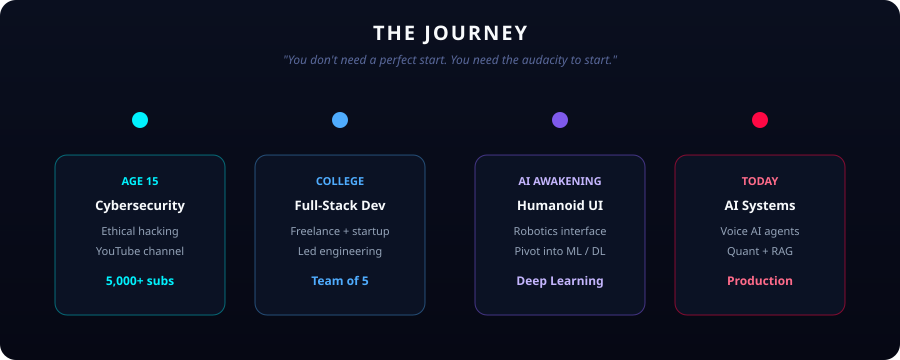
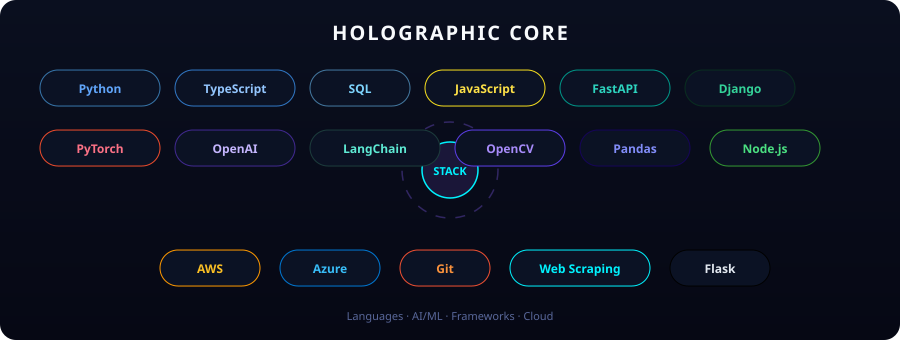
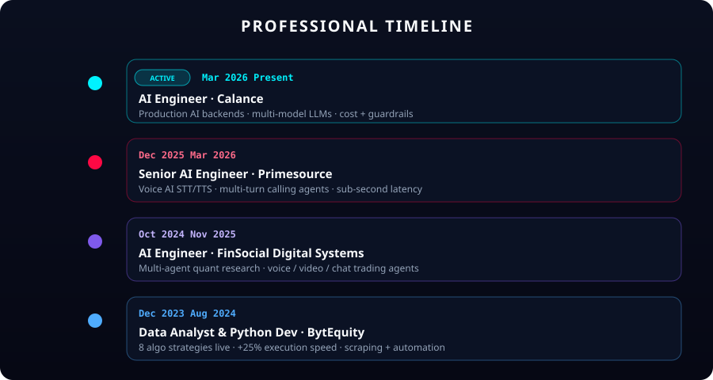

<!-- ============================================================
  Pawan Kumar — GitHub Profile
  Animated SVG sections (GitHub strips CSS; SVG animates)
  ============================================================ -->

  

  

<!-- CONNECT -->

  

  
  &nbsp;
  
  &nbsp;
  

  
  
  
  

  

<!-- WHAT I SHIP -->

  

  

<!-- JOURNEY -->

  

  

<!-- SPOTLIGHT -->

  

  
  &nbsp;
  
  &nbsp;
  
  &nbsp;
  

  

<!-- TECH STACK -->

  

  

<!-- CAREER -->

  

  

<!-- YOUTUBE -->

  

  

## Repository atlas

<strong>AI (28)</strong>

- **[TalentMagnet-AI](https://github.com/pawan941394/TalentMagnet-AI)** — LinkedIn presence → opportunity magnet
- **[opencv-ai-vision-agent](https://github.com/pawan941394/opencv-ai-vision-agent)** — OpenCV + AI agent demo
- **[agentscope-memory-finance-bot](https://github.com/pawan941394/agentscope-memory-finance-bot)** — Multi-agent finance with persistent memory
- **[AI-Agents-Memories](https://github.com/pawan941394/AI-Agents-Memories)** — Gemini chat that remembers across sessions
- **[ai-audio-agent](https://github.com/pawan941394/ai-audio-agent)** — Gemini + gTTS audio agent
- **[AI-Resume-Analyzer](https://github.com/pawan941394/AI-Resume-Analyzer)** — Resume vs JD feedback
- **[AI-Vision-Chat-Assistant](https://github.com/pawan941394/AI-Vision-Chat-Assistant)** — Chat with images via Ollama vision
- **[ai-voice-assistant](https://github.com/pawan941394/ai-voice-assistant)** — Voice assistant experiments
- **[AI-X-Ray-Imaging-Hackathon-Project](https://github.com/pawan941394/AI-X-Ray-Imaging-Hackathon-Project)** — Synthetic X-rays for medical learning
- **[Ask-Question----LLM_Project](https://github.com/pawan941394/Ask-Question----LLM_Project)** — GenAI news research tool
- **[brand-visibility-builder](https://github.com/pawan941394/brand-visibility-builder)** — Client interview → on-brand assets hub
- **[create-your-AI-Avatar](https://github.com/pawan941394/create-your-AI-Avatar)** — HeyGen avatar video from text
- **[Finance-Agent](https://github.com/pawan941394/Finance-Agent)** — Streamlit + Gemini + Yahoo Finance
- **[Naukri-Web-Scrapper-](https://github.com/pawan941394/Naukri-Web-Scrapper-)** — Naukri job scraper → CSV
- **[Nse-Option-Chain---LLM-Project](https://github.com/pawan941394/Nse-Option-Chain---LLM-Project)** — NSE options + GenAI analysis
- **[PDF-Chat-Assistant-with-Gemini-AI](https://github.com/pawan941394/PDF-Chat-Assistant-with-Gemini-AI)** — Chat with PDFs
- **[site2answers-rag](https://github.com/pawan941394/site2answers-rag)** — Crawl site → Gemini embed → Agno chat
- **[system-Prompt](https://github.com/pawan941394/system-Prompt)** — System prompt transparency archive
- **[Talk-to-your-DB----LLM_Project](https://github.com/pawan941394/Talk-to-your-DB----LLM_Project)** — NL → database insights
- **[text-to-image-and-Image-Editor-AI-Assistant](https://github.com/pawan941394/text-to-image-and-Image-Editor-AI-Assistant)** — Generate & edit images with Gemini
- **[trading-rag-assistant](https://github.com/pawan941394/trading-rag-assistant)** — Holdings/trades NL analysis
- **[Youtube-AI-Agent](https://github.com/pawan941394/Youtube-AI-Agent)** — Chat with YouTube videos
- **[YouTube-Transcript-AI-Assistant](https://github.com/pawan941394/YouTube-Transcript-AI-Assistant)** — Transcript → LLM Q&A
- **[FinBot_AI_Software_Engineer](https://github.com/pawan941394/FinBot_AI_Software_Engineer)** — FinBot experiments
- **[own_LLM](https://github.com/pawan941394/own_LLM)** — Custom LLM experiments
- **[blacboxaiwebsite](https://github.com/pawan941394/blacboxaiwebsite)** — Blackbox AI site
- **[chatbot](https://github.com/pawan941394/chatbot)** — Chatbot experiments
- **[Restaurant--Name-Menu--Creation--LLM_Project](https://github.com/pawan941394/Restaurant--Name-Menu--Creation--LLM_Project)** — Restaurant name/menu GenAI

<strong>ML (7)</strong>

- **[Air-Draw](https://github.com/pawan941394/Air-Draw-Real-Time-Mid-Air-Canvas)** — Mid-air drawing with hand landmarks
- **[animal-faces-classifier](https://github.com/pawan941394/animal-faces-classifier)** — AFHQ cat/dog/wild faces (PyTorch)
- **[audio-classification-cnn](https://github.com/pawan941394/audio-classification-cnn)** — Mel-spectrogram CNN for audio
- **[bean-leaf-disease-classification](https://github.com/pawan941394/bean-leaf-disease-classification)** — Transfer learning disease detector
- **[handwritten-digit-classifier](https://github.com/pawan941394/handwritten-digit-classifier)** — Digits 0–9 neural net
- **[rice_type_classification](https://github.com/pawan941394/rice_type_classification)** — Jasmine vs Gonen classifier
- **[Flutter_learning](https://github.com/pawan941394/Flutter_learning)** — Flutter learning notes

<strong>Data / Analytics (4)</strong>

- **[Facebook_data_analysis](https://github.com/pawan941394/Facebook_data_analysis)** — 98k records · Python / SQL / Power BI
- **[HR_Data_Analysis](https://github.com/pawan941394/HR_Data_Analysis)** — Tableau + SQL workforce insights
- **[Pizza-Store-Report](https://github.com/pawan941394/Pizza-Store-Report)** — SQL + Tableau store report
- **[YouTubeAndSpotify_DataAnalysis](https://github.com/pawan941394/YouTubeAndSpotify_DataAnalysis)** — Media analytics

<strong>Automation / Agents (3)</strong>

- **[Humanoid-robot](https://github.com/pawan941394/Humanoid-robot)** — Humanoid robotics interface
- **[linkedin-automation](https://github.com/pawan941394/linkedin-automation)** — LinkedIn automation
- **[personal_social_media](https://github.com/pawan941394/personal_social_media)** — Personal social app

<strong>Web / App (20)</strong>

- **[iNotebook-React](https://github.com/pawan941394/iNotebook-React)** — Cloud notes (React)
- **[Django_Todo_list](https://github.com/pawan941394/Django_Todo_list)** — Django todo app
- **[Django_mini_projects](https://github.com/pawan941394/Django_mini_projects)** — Beginner Django collection
- **[JavaScript-Projects](https://github.com/pawan941394/JavaScript-Projects)** — Beginner JS collection
- **[JavaScript_Games](https://github.com/pawan941394/JavaScript_Games)** — JS games
- **[Music-App](https://github.com/pawan941394/Music-App)** — Music app
- **[link_shortener-](https://github.com/pawan941394/link_shortener-)** — Django link shortener
- **[job-tracking-application](https://github.com/pawan941394/job-tracking-application)** — Job tracker
- **[Personal-Job-Tracking-application](https://github.com/pawan941394/Personal-Job-Tracking-application)** — Personal job tracker
- **[Resume_Website](https://github.com/pawan941394/Resume_Website)** — Resume / portfolio site
- **[Portfolio](https://github.com/pawan941394/Portfolio)** — Portfolio
- **[Corona-Live-Update](https://github.com/pawan941394/Corona-Live-Update)** — Live COVID updates
- **[Happy-Birthday](https://github.com/pawan941394/Happy-Birthday)** — Interactive birthday card
- **[JavaScript-Calculator](https://github.com/pawan941394/JavaScript-Calculator)** — JS calculator
- **[reactFirstWebsite](https://github.com/pawan941394/reactFirstWebsite)** — First React site
- **[reactTextUtils](https://github.com/pawan941394/reactTextUtils)** — Text utils (React)
- **[rockpaperscissor_game](https://github.com/pawan941394/rockpaperscissor_game)** — Rock paper scissors
- **[textutials_website](https://github.com/pawan941394/textutials_website)** — Text editor site
- **[Web-Animation](https://github.com/pawan941394/Web-Animation)** — Web animation demos
- **[web-developement](https://github.com/pawan941394/web-developement)** — Web learning notes

  

## Live stats

  

  

  

<!-- FOOTER CONNECT -->

  

  
  &nbsp;
  
  &nbsp;
  

  <a href="https://pawankumar.dorik.io/">Portfolio</a> ·
  <a href="https://calendly.com/pawankumarwork/30min">Book 30 min</a> ·
  <a href="https://leetcode.com/u/pawan941394/">LeetCode</a>

