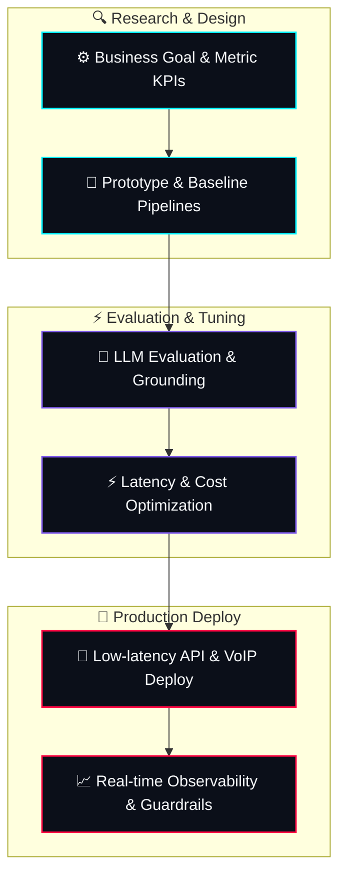

  <!-- Custom-Designed 3D Animated perspective banner -->
  

  <!-- Interactive visitor counter and followers badge -->
  
  
  

  <strong>🔥 Senior AI Engineer &amp; Data Scientist specializing in low-latency Voice AI, Multi-Agent LLM Orchestrations, &amp; Algorithmic Trading Systems</strong>

  
  
  
  
  

---

## 📡 Holographic Signal Board

<table width="100%" style="border-collapse: collapse; border: 1px solid #1e293b; background: #0b0f19; border-radius: 12px; overflow: hidden; color: #f8fafc;">
  <thead>
    <tr style="background: #101524; border-bottom: 2px solid #7f5aeb;">
      <th colspan="2" style="padding: 15px; font-size: 16px; font-weight: 700; color: #00f2fe; text-align: center; letter-spacing: 1px;">📡 HOLOGRAPHIC CORE METRICS</th>
    </tr>
  </thead>
  <tbody>
    <tr style="border-bottom: 1px solid #1e293b;">
      <td width="50%" style="padding: 15px; border-right: 1px solid #1e293b; vertical-align: top;">
        <strong style="color: #ff0844; font-size: 14px;">🤖 AI Core Focus</strong> 
        Conversational Voice Systems, Multi-Agent Orchestrations, RAG Architectures, Semantic Routing
      </td>
      <td width="50%" style="padding: 15px; vertical-align: top;">
        <strong style="color: #00f2fe; font-size: 14px;">🧠 Deep Learning &amp; Computer Vision</strong> 
        PyTorch Neural Networks, CNN Audio &amp; Leaf Blight Classifiers, Image Segmentation, NLP
      </td>
    </tr>
    <tr style="border-bottom: 1px solid #1e293b;">
      <td width="50%" style="padding: 15px; border-right: 1px solid #1e293b; vertical-align: top;">
        <strong style="color: #7f5aeb; font-size: 14px;">⚡ Production &amp; Scale</strong> 
        Sub-second Voice Latency Tuning, Cost Optimization, LLM Guardrail Controls, API Orchestrations
      </td>
      <td width="50%" style="padding: 15px; vertical-align: top;">
        <strong style="color: #4facfe; font-size: 14px;">🛠️ Technical Core</strong> 
        Python, FastAPI, Django, Django REST, SQL, AWS, Azure, APScheduler, Web Scraping Automation
      </td>
    </tr>
    <tr>
      <td width="50%" style="padding: 15px; border-right: 1px solid #1e293b; vertical-align: top;">
        <strong style="color: #e2e8f0; font-size: 14px;">💼 Professional Experience</strong> 
        3+ Years building robust AI/ML backends, scraping frameworks, and quantitative trading models.
      </td>
      <td width="50%" style="padding: 15px; vertical-align: top;">
        <strong style="color: #00F2FE; font-size: 14px;">📬 Connect Operations</strong> 
        <strong>Email:</strong> pawankumarwork9413@gmail.com <strong>Mobile:</strong> +91 9413944510 / +91 9057714590
      </td>
    </tr>
  </tbody>
</table>

---

## 💫 The Journey: Back-Bencher to Senior AI Engineer

> *"You don't need a perfect start to make your dreams come true. You just need the audacity to start."*

*   **⚡ Age 15 (Cybersecurity Maverick):** Stumbled into cybersecurity, launching an ethical hacking YouTube channel that scaled to **5,000+ subscribers** in under a year.
*   **🎓 College Days (Full-Stack Dev & Freelancer):** Discovered web engineering, self-taught full-stack development, and started freelancing before joining a high-growth startup for **7 months** as a Full-Stack Web Developer managing a team of **five engineering talents**.
*   **🤖 The AI Awakening:** Hand-selected to architect an advanced **humanoid robotics interface** project. Fell in love with machine intelligence, leading to a deep pivot into Data Science and Deep Learning.
*   **🚀 Today (AI Systems Engineer):** Designing production-ready, highly parallel Voice AI agents, multi-agent financial quantitative strategies, and enterprise RAG engines with robust, low-latency backends.

---

## 🎙️ Core Engineering Pillars

<table width="100%">
  <tr>
    <td width="50%" valign="top">
      <h3>🗣️ Voice AI &amp; Conversational LLMs</h3>
      <ul>
        <li><strong>STT/TTS Pipelines:</strong> Built sub-second latency voice systems using premium real-time STT and TTS architectures.</li>
        <li><strong>Conversational Agents:</strong> Designed multi-turn voice agents capable of handling complex intent, interruptibility, and semantic routing.</li>
        <li><strong>Deployment:</strong> Integrated LLMs with enterprise SIP/VoIP infrastructure for automated outbound/inbound dialer networks.</li>
      </ul>
    </td>
    <td width="50%" valign="top">
      <h3>📈 Algorithmic Quant &amp; Multi-Agents</h3>
      <ul>
        <li><strong>Trading Systems:</strong> Engineered highly scalable multi-agent LLM systems to analyze market movements and coordinate trade execution.</li>
        <li><strong>Automated Strategies:</strong> Deployed <strong>8+ algorithmic trading scripts</strong> on Fyers &amp; Zerodha Kite API, boosting trade speed and efficiency by <strong>25%</strong>.</li>
        <li><strong>RAG Orchestration:</strong> Developed Streamlit &amp; Agno finance bots leveraging grounded retrieval chains.</li>
      </ul>
    </td>
  </tr>
</table>

---

## 🧬 AI Production Lifecycle

To translate theoretical algorithms into robust, revenue-producing enterprise assets, I execute my builds along a rigorous deployment flowchart:

---

## 🛠️ Tech Stack &amp; Holographic Core

<table width="100%" style="border-collapse: collapse; border: none;">
  <tr style="border: none;">
    <!-- Column 1: Languages -->
    <td width="50%" valign="top" style="border: none; padding-right: 12px; padding-bottom: 24px;">
      

        <h3 style="margin-top: 0; color: #00f2fe; font-size: 16px; font-weight: 700; letter-spacing: 0.5px; border-bottom: 1px solid rgba(0, 242, 254, 0.2); padding-bottom: 8px; margin-bottom: 12px;">🐍 CORE LANGUAGES</h3>
        

          
          
          
          
          
        

      

    </td>
    <!-- Column 2: AI/ML & Data -->
    <td width="50%" valign="top" style="border: none; padding-left: 12px; padding-bottom: 24px;">
      

        <h3 style="margin-top: 0; color: #ff0844; font-size: 16px; font-weight: 700; letter-spacing: 0.5px; border-bottom: 1px solid rgba(255, 8, 68, 0.2); padding-bottom: 8px; margin-bottom: 12px;">🧠 AI/ML &amp; DATA SCIENCE</h3>
        

          
          
          
          
          
          
        

      

    </td>
  </tr>
  <tr style="border: none;">
    <!-- Column 3: Web Frameworks -->
    <td width="50%" valign="top" style="border: none; padding-right: 12px;">
      

        <h3 style="margin-top: 0; color: #7f5aeb; font-size: 16px; font-weight: 700; letter-spacing: 0.5px; border-bottom: 1px solid rgba(127, 90, 235, 0.2); padding-bottom: 8px; margin-bottom: 12px;">🌐 WEB FRAMEWORKS</h3>
        

          
          
          
          
          
        

      

    </td>
    <!-- Column 4: Cloud & DevOps -->
    <td width="50%" valign="top" style="border: none; padding-left: 12px;">
      

        <h3 style="margin-top: 0; color: #4facfe; font-size: 16px; font-weight: 700; letter-spacing: 0.5px; border-bottom: 1px solid rgba(79, 172, 254, 0.2); padding-bottom: 8px; margin-bottom: 12px;">⚙️ CLOUD &amp; AUTOMATION</h3>
        

          
          
          
          
          
        

      

    </td>
  </tr>
</table>

---

## 🎥 YouTube Creator Hub

  
  

    I build and breakdown production-grade AI systems, sharing end-to-end Python &amp; LLM tutorials.
  

  

    ✨ <i>Featured content: Multi-Agent Systems, Streamlit Dashboards, Voice Chatbots, and Web Scraping Automation.</i>
  

  

---

## 🚀 Spotlight Builds

### 📈 [NSE Option Chain Generative AI Analyst](https://github.com/pawan941394/Nse-Option-Chain---LLM-Project)
> **Stack: Python, Generative AI, NSE Option Chains, Streamlit**
*   Designed a quantitative analytics dashboard parsing real-time National Stock Exchange (NSE) option chains.
*   Integrated advanced LLM reasoning to conduct quantitative trade analysis, support/resistance finding, and volatility strategies in natural language.

### 🧠 [AgentScope Memory Finance Bot](https://github.com/pawan941394/agentscope-memory-finance-bot)
> **Stack: Python, AgentScope, LLM, Persistent Memory**
*   Built an autonomous financial assistant utilizing the **AgentScope** multi-agent framework.
*   Engineered a persistent memory architecture allowing agents to remember historical portfolios, user risk profiles, and context-dependent trade rules across sessions.

### 🎥 [AI YouTube Video Automation Core](https://github.com/pawan941394/AI-YouTube-Video-Automation)
> **Stack: Python, OpenAI, FFmpeg, YouTube API**
*   An end-to-end autonomous content creation suite.
*   Takes a raw topic, synthesizes highly engaging scripts via GPT models, constructs visuals/audio, generates customized thumbnails, prepares optimized SEO tags, and automates publishing directly to YouTube.

### 🩺 [MedX Tutor / Radiographic Imaging](https://github.com/pawan941394/AI-X-Ray-Imaging-Hackathon-Project)
> **Stack: TypeScript, Stable Diffusion, LLMs, Medical Datasets**
*   Developed during a fast-paced medical AI hackathon.
*   Generates high-fidelity synthetic X-ray models from natural language diagnostic notes, acting as a guided educational visual assistant for radiologists and medical students.

---

## 💼 Professional Timeline &amp; Breakthroughs

<table width="100%">
  <!-- Row 1: Calance -->
  <tr style="border: none;">
    <td width="28%" valign="top" style="border: none; border-right: 2px solid #7f5aeb; text-align: right; padding-right: 15px;">
      Mar 2026 - Present 
      ACTIVE CORE
    </td>
    <td width="72%" valign="top" style="border: none; padding-left: 15px; padding-bottom: 25px;">
      <h3 style="margin: 0; color: #ffffff; font-size: 20px;">AI Engineer</h3>
      <strong style="color: #4facfe; font-size: 16px;">Calance</strong> · Gurugram, India  
       
      <ul style="margin-top: 10px; color: #94a3b8; line-height: 1.5;">
        <li>Architecting production-scale AI backend engines and low-latency API architectures for enterprise application stacks.</li>
        <li>Deploying highly reliable, multi-model LLM systems with focus on cost optimization and robust guardrail routing.</li>
      </ul>
    </td>
  </tr>

  <!-- Row 2: Primesource Consulting -->
  <tr style="border: none;">
    <td width="28%" valign="top" style="border: none; border-right: 2px solid #ff0844; text-align: right; padding-right: 15px;">
      Dec 2025 - Mar 2026 
      SENIOR ROLE
    </td>
    <td width="72%" valign="top" style="border: none; padding-left: 15px; padding-bottom: 25px;">
      <h3 style="margin: 0; color: #ffffff; font-size: 20px;">Senior AI Engineer</h3>
      <strong style="color: #ff0844; font-size: 16px;">Primesource Consulting LLP</strong> · Voice AI Operations  
       
      <ul style="margin-top: 10px; color: #94a3b8; line-height: 1.5;">
        <li>Designed and constructed production-grade **Voice AI systems**, integrating advanced real-time Speech-to-Text (STT) and Text-to-Speech (TTS) pipelines.</li>
        <li>Built AI calling agents capable of natural, multi-turn conversations, featuring dynamic intent handling, interruptibility, and sub-second latency tuning.</li>
      </ul>
    </td>
  </tr>

  <!-- Row 3: FinSocial Digital Systems -->
  <tr style="border: none;">
    <td width="28%" valign="top" style="border: none; border-right: 2px solid #7f5aeb; text-align: right; padding-right: 15px;">
      Oct 2024 - Nov 2025 
      QUANT AI
    </td>
    <td width="72%" valign="top" style="border: none; padding-left: 15px; padding-bottom: 25px;">
      <h3 style="margin: 0; color: #ffffff; font-size: 20px;">AI Engineer</h3>
      <strong style="color: #7f5aeb; font-size: 16px;">FinSocial Digital Systems</strong> · Newark, DE (Remote)  
       
      <ul style="margin-top: 10px; color: #94a3b8; line-height: 1.5;">
        <li>Engineered a multi-agent LLM framework designed to streamline quantitative market research and analyze trading execution.</li>
        <li>Developed diverse, persistent AI agents (including voice, video, and chat modules) to enhance user intelligence on algorithmic trading platforms.</li>
      </ul>
    </td>
  </tr>

  <!-- Row 4: BytEquity -->
  <tr style="border: none;">
    <td width="28%" valign="top" style="border: none; border-right: 2px solid #00f2fe; text-align: right; padding-right: 15px;">
      Dec 2023 - Aug 2024 
      ALGO SYSTEMS
    </td>
    <td width="72%" valign="top" style="border: none; padding-left: 15px; padding-bottom: 5px;">
      <h3 style="margin: 0; color: #ffffff; font-size: 20px;">Data Analyst &amp; Python Developer</h3>
      <strong style="color: #00f2fe; font-size: 16px;">BytEquity</strong> · Noida, India  
       
      <ul style="margin-top: 10px; color: #94a3b8; line-height: 1.5;">
        <li>Coded, tested, and deployed **8 automated quantitative trading strategies** on Fyers &amp; Kite platforms, raising execution speed by **25%**.</li>
        <li>Built web scraping engines and a custom no-code marketing automation system (WhatsApp/Email) handling scaled consumer queries.</li>
      </ul>
    </td>
  </tr>
</table>

---

## 📁 Repository Atlas

Click on the tabs below to explore all of my repositories grouped by core engineering tracks:

<strong>🤖 AI (28)</strong>

 

-   **[TalentMagnet-AI](https://github.com/pawan941394/TalentMagnet-AI)** : Transform your LinkedIn presence from a passive resume into an active, opportunity-attracting machine
-   **[Open CV with AI Agent](https://github.com/pawan941394/opencv-ai-vision-agent)**: OpenCV AI Agent Demo application
-   **[Agent Scope Memory Finance Agent](https://github.com/pawan941394/agentscope-memory-finance-bot)**: agentscope-memory-finance-bot
-   **[AI-Agents-Memories](https://github.com/pawan941394/AI-Agents-Memories)**: A simple, persistent chat application powered by Google's Gemini AI that remembers your conversation history across sessions.
-   **[ai-audio-agent](https://github.com/pawan941394/ai-audio-agent)**: This AI Audio Agent is an intelligent text-to-speech conversion bot powered by Google Gemini AI and Google Text-to-Speech (gTTS). The agent can understand natural language commands and convert any text into high-quality audio files.
-   **[AI-Resume-Analyzer](https://github.com/pawan941394/AI-Resume-Analyzer)**: An AI-powered application that analyzes your resume against specific job descriptions, providing personalized feedback and recommendations to help improve your chances of landing your dream job.
-   **[AI-Vision-Chat-Assistant](https://github.com/pawan941394/AI-Vision-Chat-Assistant)**: An intelligent image analysis tool that combines the power of Large Language Models (LLM) with computer vision to provide interactive conversations about any image. This project leverages Ollama's vision model to analyze images and respond to user queries in natural language.
-   **[ai-voice-assistant](https://github.com/pawan941394/ai-voice-assistant)**: No description
-   **[AI-X-Ray-Imaging-Hackathon-Project](https://github.com/pawan941394/AI-X-Ray-Imaging-Hackathon-Project)**: An innovative AI-powered medical education platform that generates synthetic X-rays from natural language prompts and provides interactive learning experiences for medical students and professionals.
-   **[Ask-Question----LLM_Project](https://github.com/pawan941394/Ask-Question----LLM_Project)**: With so much information online, extracting relevant insights can be tough. I created Gen AI: News Research Tool to simplify this process, using AI to help users quickly get precise answers from news articles.
-   **[blacboxaiwebsite](https://github.com/pawan941394/blacboxaiwebsite)**: No description
-   **[brand-visibility-builder](https://github.com/pawan941394/brand-visibility-builder)**: A unified AI workspace that interviews your client, captures every requirement, and spins up on-brand assets in a single collaborative hub.
-   **[chatbot](https://github.com/pawan941394/chatbot)**: No description
-   **[create-your-AI-Avatar](https://github.com/pawan941394/create-your-AI-Avatar)**: Transform any text into professional AI avatar videos using the power of HeyGen API! Just type your message, and watch as a realistic AI avatar speaks your words with perfect lip-sync and natural expressions.
-   **[Finance-Agent](https://github.com/pawan941394/Finance-Agent)**: A powerful AI-powered finance assistant built with Streamlit that provides real-time stock analysis, analyst recommendations, and financial data insights using Google's Gemini AI and Yahoo Finance.
-   **[FinBot_AI_Software_Engineer](https://github.com/pawan941394/FinBot_AI_Software_Engineer)**: No description
-   **[Naukri-Web-Scrapper-](https://github.com/pawan941394/Naukri-Web-Scrapper-)**: A powerful Python tool for scraping job listings from Naukri.com, allowing you to search for jobs by title and collect detailed information in a CSV format.
-   **[Nse-Option-Chain---LLM-Project](https://github.com/pawan941394/Nse-Option-Chain---LLM-Project)**: This project was developed by a single developer with a passion for combining financial data analysis with cutting-edge AI technologies. The NSE Option Chain With Gen AI tool brings together real-time stock market data and AI-driven insights to help users make informed decisions. By leveraging the power of the NSE API and generative AI.
-   **[own_LLM](https://github.com/pawan941394/own_LLM)**: No description
-   **[PDF-Chat-Assistant-with-Gemini-AI](https://github.com/pawan941394/PDF-Chat-Assistant-with-Gemini-AI)**: A Streamlit web application that allows users to upload PDF documents and have interactive conversations about their content using Google's Gemini AI.
-   **[Restaurant--Name-Menu--Creation--LLM_Project](https://github.com/pawan941394/Restaurant--Name-Menu--Creation--LLM_Project)**: No description
-   **[site2answers-rag](https://github.com/pawan941394/site2answers-rag)**: Site-to-answers RAG chatbot: crawl a site, embed with Gemini, retrieve top chunks, and chat via Agno
-   **[system-Prompt](https://github.com/pawan941394/system-Prompt)**: SYSTEM PROMPT TRANSPARENCY FOR ALL - CHATGPT, GEMINI, GROK, CLAUDE, PERPLEXITY, CURSOR, WINDSURF, DEVIN, REPLIT, AND MORE!
-   **[Talk-to-your-DB----LLM_Project](https://github.com/pawan941394/Talk-to-your-DB----LLM_Project)**: In many organizations, valuable data often remains untapped because only a few people have the technical skills to access it. Talk To Your DB was built to address this challenge. By enabling natural language queries, my goal is to bridge the gap between data and decision-making, allowing more people to gain actionable insights from their databases.
-   **[text-to-image-and-Image-Editor-AI-Assistant](https://github.com/pawan941394/text-to-image-and-Image-Editor-AI-Assistant)**: AI Image Generator & Assistant! Leverage the power of Streamlit and Gemini AI to generate and edit images with creative text prompts. Build stunning visuals or refine your images effortlessly.
-   **[trading-rag-assistant](https://github.com/pawan941394/trading-rag-assistant)**: An AI-powered chatbot built with Streamlit and Agno AI Agent that helps you analyze holdings and trades data using natural language queries.
-   **[Youtube-AI-Agent](https://github.com/pawan941394/Youtube-AI-Agent)**: Bharat AI Connect YouTube Agent is an intelligent AI-powered assistant that transforms how you interact with YouTube videos. Upload a video URL, and our AI will help you extract valuable insights, summaries, and answer any questions about the content!
-   **[YouTube-Transcript-AI-Assistant](https://github.com/pawan941394/YouTube-Transcript-AI-Assistant)**: An AI-powered tool that extracts YouTube video transcripts and lets you chat with the content using LLMs. Get insights, summaries, and answers without watching the entire video. Built with Python and Streamlit, it supports multiple languages, auto-generated captions, and provides a clean interface for interacting with video content.

<strong>📊 ML (6)</strong>

 

-   **[animal-faces-classifier](https://github.com/pawan941394/animal-faces-classifier)**: A compact PyTorch pipeline that learns to recognize cat, dog, and wild animal faces from the AFHQ dataset.
-   **[Audio-classification-cnn](https://github.com/pawan941394/audio-classification-cnn)**: A cutting-edge deep learning project for classifying audio recordings of Quran recitations using Convolutional Neural Networks (CNN) and mel-spectrogram features.
-   **[bean-leaf-disease-classification](https://github.com/pawan941394/bean-leaf-disease-classification)**: Early detection of fungal disease can reduce yield loss by enabling faster intervention. This repo demonstrates a compact, reproducible image-classification pipeline with transfer learning.
-   **[Flutter_learning](https://github.com/pawan941394/Flutter_learning)**: No description
-   **[handwritten-digit-classifier](https://github.com/pawan941394/handwritten-digit-classifier)**: A deep learning project that recognizes handwritten digits (0-9) using a Neural Network built with PyTorch.
-   **[rice_type_classification](https://github.com/pawan941394/rice_type_classification)**: A deep learning project to classify rice types (Jasmine vs Gonen) using a Neural Network built with PyTorch.

<strong>📈 Data/Analytics (4)</strong>

 

-   **[Facebook_data_analysis](https://github.com/pawan941394/Facebook_data_analysis)**: Welcome to the "Facebook Data Analysis" project, where we've embarked on an exciting journey into the world of data. With 98,000 records at our fingertips, we've harnessed the power of Python, SQL, and Power BI to uncover valuable insights.
-   **[HR_Data_Analysis](https://github.com/pawan941394/HR_Data_Analysis)**: Welcome to the HR Data Analysis project repository. This project utilizes Tableau and SQL to analyze and visualize human resources data, providing valuable insights into our organization's workforce.
-   **[Pizza-Store-Report](https://github.com/pawan941394/Pizza-Store-Report)**: It's an Data Analysis Project where  I have developed a Complete "" With the SQl  and Tableau .
-   **[YouTubeAndSpotify_DataAnalysis](https://github.com/pawan941394/YouTubeAndSpotify_DataAnalysis)**: "YouTube and Spotify Data Analysis"

<strong>⚙️ Automation/Agents (3)</strong>

 

-   **[Humanoid-robot](https://github.com/pawan941394/Humanoid-robot)**: No description
-   **[linkedin-automation](https://github.com/pawan941394/linkedin-automation)**: No description
-   **[personal_social_media](https://github.com/pawan941394/personal_social_media)**: in this project i have created a personal social app .

<strong>💻 Web/App (20)</strong>

 

-   **[Corona-Live-Update](https://github.com/pawan941394/Corona-Live-Update)**: Feel free to use our app
-   **[Django_mini_projects](https://github.com/pawan941394/Django_mini_projects)**: hello, everyone I have created some Django projects for beginners, I hope you like it and you can also contribute here and also add some new projects for beginners
-   **[Django_Todo_list](https://github.com/pawan941394/Django_Todo_list)**: hello everyone today I have created a lTodo app with Django I hope you all like it then tell me how I can minimize code.
-   **[Happy-Birthday](https://github.com/pawan941394/Happy-Birthday)**: This is a web based interactive birthday card.
-   **[iNotebook-React](https://github.com/pawan941394/iNotebook-React)**: INotebook is a React Application for managing personal notes on the cloud
-   **[JavaScript-Calculator](https://github.com/pawan941394/JavaScript-Calculator)**: hello guys today I have created my first music app with javaScript calculator. Check this how is this and also contribute if you can
-   **[JavaScript-Projects](https://github.com/pawan941394/JavaScript-Projects)**: hello, everyone I have created some javascript projects  for beginners, I hope you like it and you can also contribute here and also add some new projects for beginners
-   **[JavaScript_Games](https://github.com/pawan941394/JavaScript_Games)**: Hello everyone i have created some cool game through javascript . Tell me how is this .
-   **[job-tracking-application](https://github.com/pawan941394/job-tracking-application)**: No description
-   **[link_shortener-](https://github.com/pawan941394/link_shortener-)**: hello everyone today I have created a link shortener app with Django I hope you all like it then tell me how I can minimize code.
-   **[Music-App](https://github.com/pawan941394/Music-App)**: Today I have created my first music app with java. Check this how is this and also contribute if you can
-   **[Personal-Job-Tracking-application](https://github.com/pawan941394/Personal-Job-Tracking-application)**: No description
-   **[Portfolio](https://github.com/pawan941394/Portfolio)**: No description
-   **[reactFirstWebsite](https://github.com/pawan941394/reactFirstWebsite)**: No description
-   **[reactTextUtils](https://github.com/pawan941394/reactTextUtils)**: No description
-   **[Resume_Website](https://github.com/pawan941394/Resume_Website)**: i have created a resume website . you can use this as a portfolio
-   **[rockpaperscissor_game](https://github.com/pawan941394/rockpaperscissor_game)**: Hello everyone i have created some this game through javascript . Tell me how is this .
-   **[textutials_website](https://github.com/pawan941394/textutials_website)**: edit your texts
-   **[Web-Animation](https://github.com/pawan941394/Web-Animation)**: hello, everyone I have created some web animation projects for beginners, I hope you like it and you can also contribute here and also add some new projects for beginners
-   **[web-developement](https://github.com/pawan941394/web-developement)**: learn together

<strong>📦 Other (25)</strong>

 

-   **[Analyzing_Banking_Trends](https://github.com/pawan941394/Analyzing_Banking_Trends)**: Analyzing Banking Trends: Customer Transactions and Regional Impact
-   **[codevirus](https://github.com/pawan941394/codevirus)**: No description
-   **[codevirus-code](https://github.com/pawan941394/codevirus-code)**: codevirus complete code
-   **[CPP-Programming](https://github.com/pawan941394/CPP-Programming)**: here you will be get complete topics and many question with solution
-   **[DAMNCON](https://github.com/pawan941394/DAMNCON)**: No description
-   **[Dream_project](https://github.com/pawan941394/Dream_project)**: No description
-   **[evaluate-resume-with-job-description-and-make-assessment](https://github.com/pawan941394/evaluate-resume-with-job-description-and-make-assessment)**: No description
-   **[Google-Meet](https://github.com/pawan941394/Google-Meet)**: No description
-   **[hackershala_project](https://github.com/pawan941394/hackershala_project)**: No description
-   **[images-optamization](https://github.com/pawan941394/images-optamization)**: images optamization
-   **[InstaGram_Clone](https://github.com/pawan941394/InstaGram_Clone)**: No description
-   **[MakeANote](https://github.com/pawan941394/MakeANote)**: No description
-   **[makeanotetesting](https://github.com/pawan941394/makeanotetesting)**: No description
-   **[MakeNote.in](https://github.com/pawan941394/MakeNote.in)**: No description
-   **[Naukri.com-Clone](https://github.com/pawan941394/Naukri.com-Clone)**: No description
-   **[neworga](https://github.com/pawan941394/neworga)**: No description
-   **[oceanthink](https://github.com/pawan941394/oceanthink)**: No description
-   **[pawan941394](https://github.com/pawan941394/pawan941394)**: No description
-   **[python-programing](https://github.com/pawan941394/python-programing)**: codeing problem
-   **[Python-with-Projects-](https://github.com/pawan941394/Python-with-Projects-)**: hello, everyone I have created some python projects for beginners, I hope you like it and you can also contribute here and also add some new projects for beginners
-   **[TCS-iON-RIO-45](https://github.com/pawan941394/TCS-iON-RIO-45)**: No description
-   **[testing](https://github.com/pawan941394/testing)**: No description
-   **[testing_repo](https://github.com/pawan941394/testing_repo)**: No description
-   **[TicTacToeGame](https://github.com/pawan941394/TicTacToeGame)**: Hello everyone i have created a Tic toe game i hope you like it
-   **[unifiedTechnology](https://github.com/pawan941394/unifiedTechnology)**: No description

---

## 📊 Live Stats Dashboard

  

---

  <h3>📬 Let's Construct Something Innovative Together!</h3>
  
Whether it is building custom voice agents, scaling LLM pipelines, or writing quant trading strategies, let's connect!

  

    <strong>Email:</strong> <a href="mailto:pawankumarwork9413@gmail.com">pawankumarwork9413@gmail.com</a> | 
    <strong>LinkedIn:</strong> <a href="https://www.linkedin.com/in/pawan941394/">in/pawan941394</a> | 
    <strong>Portfolio:</strong> <a href="https://pawankumar.dorik.io/">pawankumar.dorik.io</a>
  

